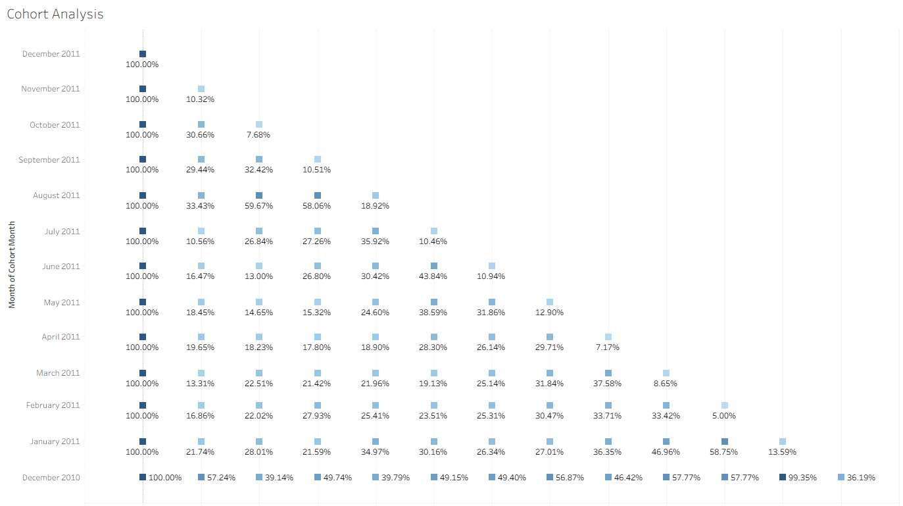

# Online Retail Store - Customer Segmentation and Behavior Analysis

This project is an end-to-end analysis of an online retailer's sales data. The primary goal is to provide actionable business strategies by identifying distinct customer segments and analyzing their behavior over time. Using RFM modeling, cohort analysis, and product preference analysis, this case study uncovers key business risks and opportunities for growth.

---
## Business Objective

This analysis seeks to answer the strategic question: **"What data-driven recommendations can be made to increase revenue and customer loyalty for this online retail business?"**

---
## Tools and Technologies Used

* **Languages:** Python, SQL
* **Libraries & Platforms:** Pandas, Google BigQuery, Tableau
---
## Methodology Deep Dive: Customer Segments Explained
The analysis produced five distinct customer segments based on their RFM (Recency, Frequency, Monetary) scores. These scores were calculated by ranking each customer from 1 to 4 in each category using the NTILE(4) window function in SQL. A higher score is always better.

The meaning of each score is as follows:

| Score | Recency (R) | Frequency (F) | Monetary (M) |
| :--- | :--- | :--- | :--- |
| **4** | Most Recent (Top 25%) | Most Frequent (Top 25%) | Highest Spending (Top 25%) |
| **3** | Fairly Recent (25-50%) | Fairly Frequent (25-50%) | High Spending (25-50%) |
| **2** | Not very Recent (50-75%) | Infrequent (50-75%) | Low Spending (50-75%) |
| **1** | Least Recent (Bottom 25%)| Least Frequent (Bottom 25%) | Lowest Spending (Bottom 25%)|

Based on combinations of these scores, customers were classified into the following segments:

Loyal Customers: Best customers. They consistently score high across all three categories (e.g., scores like 444, 434, 344). They are the stable core of the business, and the priority is to retain and reward them.

Promising: Recent customers (Recency of 3 or 4) who show potential but do not yet buy frequently or spend a lot. This is the largest group by customer count and represents the biggest pool for growth. The priority is to nurture them.

At-Risk: Customers who used to be valuable (high Frequency and/or Monetary scores) but have not purchased in a while (Recency of 1 or 2). They are the most critical segment for immediate action. The priority is intervention and re-engagement.

Lapsed VIPs: A small but historically valuable group. They have a history of spending a lot (Monetary score of 4) but have become inactive (Recency of 1 or 2). They are ideal candidates for high-effort win-back campaigns.

Lost: Customers with low scores across the board (e.g., scores like 111, 121, 211). They are the lowest priority for marketing spend.

---
## Interactive Dashboard

*Click the image above to interact with the full dashboard on Tableau Public.*

---
## Analysis and Key Findings

The analysis produced five distinct customer segments and revealed several critical insights into the business's revenue streams and customer retention patterns.

### Finding 1: Revenue is Dangerously Concentrated in 'At-Risk' Customers
The most critical finding is that the 'At-Risk' segment is the single largest source of revenue (over 8.4 million). This identifies a significant business risk, as the company's income is heavily dependent on a large group of high-value customers who are showing decreased engagement.

### Finding 2: The Customer Retention Story

The cohort analysis shows that the biggest drop-off in customer activity occurs immediately after the first month. It also reveals that the earliest customer cohort (December 2010) had significantly better long-term retention, providing an opportunity to analyze past business practices for clues to improving loyalty today.

---
## Limitations and Recommendations for Future Analysis

While this analysis identifies **WHAT** is happening, the data cannot definitively explain **WHY**. To understand the root causes, the following next steps are recommended:

* **Analyze Product Purchase Patterns:** Deeper analysis of the 'At-Risk' segment's purchases confirmed they buy low-cost, repeatable-purchase items, suggesting their departure is not related to product lifecycle but rather to factors like competition or customer experience.
* **Investigate Retention Drivers:** A future analysis should investigate the business practices, marketing campaigns, or product assortment from the highly successful "December 2010" cohort period to identify strategies that can be replicated.
* **Conduct Customer Surveys:** The most direct way to find out why customers are leaving is to ask them. A targeted survey to the 'At-Risk' segment could provide direct feedback on pricing, product satisfaction, or customer service.

---
## Strategic Recommendations

Based on the analysis, the following data-driven solutions can be implemented:

1.  **Save the 'At-Risk' Segment (Priority #1):** Launch an aggressive re-engagement campaign for this group, using product data to personalize offers and prevent the loss of the company's primary revenue stream.
2.  **Nurture the 'Promising' Segment:** Implement marketing automation to guide this large group toward their next purchase and convert them into Loyal Customers.
3.  **Reward 'Loyal Customers':** Protect this reliable segment by implementing a VIP or loyalty program to reward their high frequency.
4.  **Win Back 'Lapsed VIPs':** Create a special, high-value offer for this small but historically valuable group.

---
## Code
All SQL scripts used for data modeling and analysis in Google BigQuery can be found in the [sql_scripts folder](sql_scripts/).
